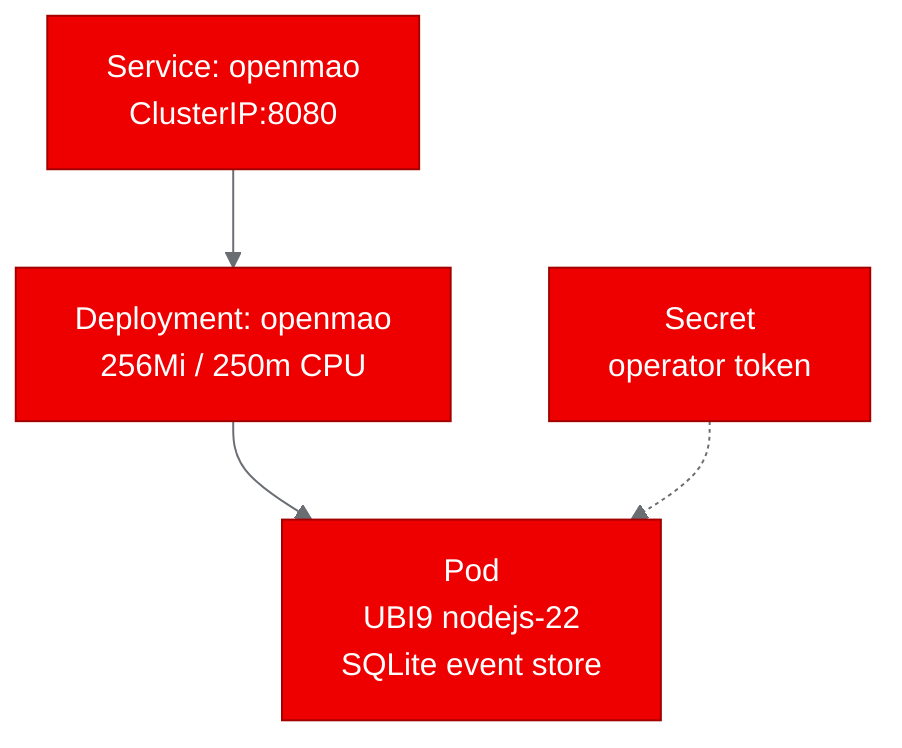

## What is OpenMAO?

OpenMAO is an open-source governance substrate for AI-native organizations. Instead of handing a swarm of agents the keys and hoping for the best, OpenMAO takes the opposite approach: autonomy is earned, not assumed.

Every action an agent takes is owned, governed, and auditable. The system widens what agents are allowed to do only based on a track record it can prove. The result is a flywheel: governance feeds institutional memory, memory feeds self-correction, and self-correction earns wider autonomy.

The project is self-hostable, Apache-2.0 licensed, and ships with a built-in demo that requires zero API keys, zero LLM calls, and zero external services.

## Why AI governance matters for Red Hat OpenShift AI

Enterprise teams deploying AI agents on Red Hat OpenShift AI face a fundamental tension. Agents need autonomy to be useful, but uncontrolled autonomy creates risk. Before an agent can send emails, deploy code, or modify databases in production, someone needs to answer: who authorized this, what are the boundaries, and where is the audit trail?

OpenMAO addresses this by sitting between your agent frameworks and their side effects. It provides:

- **Bounded work envelopes**: each task an agent receives has explicit scope, allowed capabilities, and an owner
- **Approval gates**: consequential actions suspend execution until a human (or a trusted policy) approves
- **Institutional memory**: what one agent learns becomes shared organizational knowledge, promoted only after corroboration and approval
- **Hash-chain event sourcing**: every event is linked by cryptographic hash, making tampering detectable

This governance layer is framework-agnostic. Swap your agent runtime tomorrow and the organization, its memory, and its audit trail remain intact.

## Containerizing for OpenShift

OpenMAO is a Node.js 22 application with only three runtime dependencies: `better-sqlite3` for the event store, `zod` for schema validation, and `zod-to-json-schema` for canonical schemas. No GPU, no Redis, no Postgres.

We used `registry.access.redhat.com/ubi9/nodejs-22` as the base image. The main challenge was that the upstream server binds to `127.0.0.1` and rejects non-loopback connections (a deliberate security measure for local development). We solved this with a lightweight entrypoint wrapper (`entrypoint.mjs`) that binds the server to `0.0.0.0` and spoofs the loopback check so Kubernetes pod networking works correctly.

The `Dockerfile.ubi` is straightforward:

```dockerfile
FROM registry.access.redhat.com/ubi9/nodejs-22
WORKDIR /opt/app-root/src
USER 0
RUN dnf install -y gcc gcc-c++ make python3 && dnf clean all
USER 1001
COPY package.json package-lock.json ./
RUN npm ci
COPY . .
USER 0
RUN chgrp -R 0 /opt/app-root && chmod -R g=u /opt/app-root
EXPOSE 8080
ENV PORT=8080
ENV OPENMAO_LISTEN_HOST=0.0.0.0
USER 1001
CMD ["npx", "tsx", "entrypoint.mjs"]
```

The `gcc` and `make` packages are needed because `better-sqlite3` compiles a native addon at install time. OpenShift compatibility requires `chgrp -R 0` (run as root, then switch back to USER 1001) and a non-privileged port.

## Deploying to the cluster

The Kubernetes manifests are minimal: a Namespace, a Deployment with readiness/liveness probes on `/health`, a ClusterIP Service on port 8080, and a Secret holding the operator console token.



We built the image using OpenShift's built-in BuildConfig with binary build strategy, which uploads the source code directly to the cluster for building. The resulting image was pushed to `quay.io/aicatalyst/openmao:latest`.

Resource requirements are modest: 256Mi memory and 250m CPU. The pod reached Running state within 43 seconds of applying the manifests.

## Running the PoC validation

We defined five test scenarios that exercise the core governance workflow:

| Scenario | What it tests | Result |
|----------|--------------|--------|
| Health check | API server responds on `/health` | Pass (0.02s) |
| Console accessible | Operator console HTML is served | Pass (0.01s) |
| Run demo | Create org, run agents, suspend at approval gate | Pass (0.08s) |
| Approve demo | Approve promotion, complete run, promote memory | Pass (0.18s) |
| World model | Verify organizational state after workflow | Pass (0.01s) |

All five scenarios passed. The full governance workflow, from organization creation through agent execution, approval gate suspension, memory promotion, to world model verification, completed in under 300ms total.

The demo is deterministic: it creates a two-agent organization, assigns a research task, generates an artifact, proposes promoting it to collective memory, and then waits at an approval gate. Approving the gate completes the run and promotes the memory. No LLM calls, no randomness, no external dependencies.

## What we learned

**The loopback restriction was the only real obstacle.** OpenMAO's `isLoopbackAddress` check is a deliberate security decision for local development. In a production deployment on OpenShift, network policies and RBAC handle access control instead, so bypassing the check in the container is appropriate.

**Native compilation works fine on UBI9.** The `better-sqlite3` package compiled cleanly with the GCC toolchain available in the UBI9 nodejs-22 image. No exotic build dependencies were needed.

**OpenShift BuildConfig simplifies CI.** Using `oc start-build --from-dir` for binary builds eliminated the need for a local container runtime or a separate CI pipeline. The cluster handles building and pushing.

**SQLite is sufficient for PoC but needs persistence for production.** The ephemeral SQLite database resets when the pod restarts. For a production deployment, mounting a PersistentVolumeClaim at the `.openmao/` directory would preserve the event store and organizational memory across restarts.

## Try it yourself

The fork with all PoC artifacts is at [github.com/aicatalyst-team/OpenMAO](https://github.com/aicatalyst-team/OpenMAO). The `autopoc-artifacts` branch contains the PoC plan, test script, and full report.

To deploy on your own cluster:

1. Apply the Kubernetes manifests from the `kubernetes/` directory
2. Set a secure `OPENMAO_OPERATOR_TOKEN` in the Secret
3. Access the operator console at the service URL on port 8080
4. Run the demo: `POST /runs/demo` followed by `POST /runs/demo/approve`

If you're building AI agent systems on Red Hat OpenShift AI, OpenMAO provides the accountability layer that sits between your agents and their side effects. The governance is the feature.
