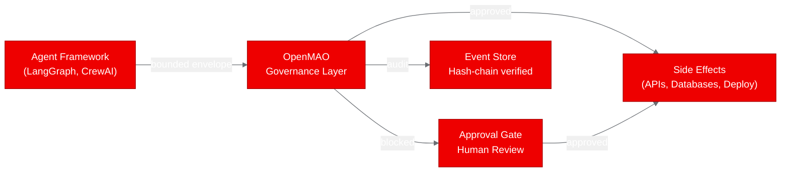
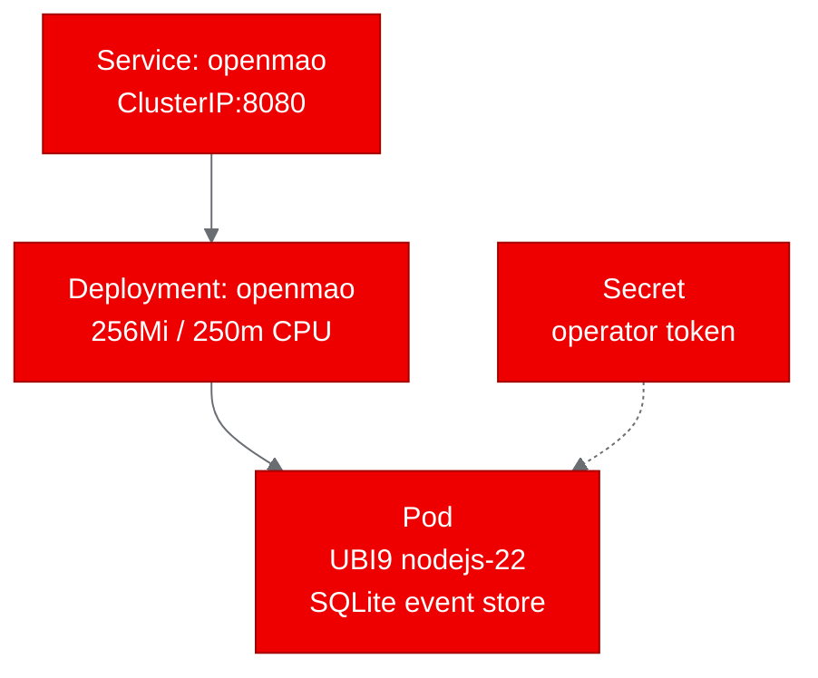
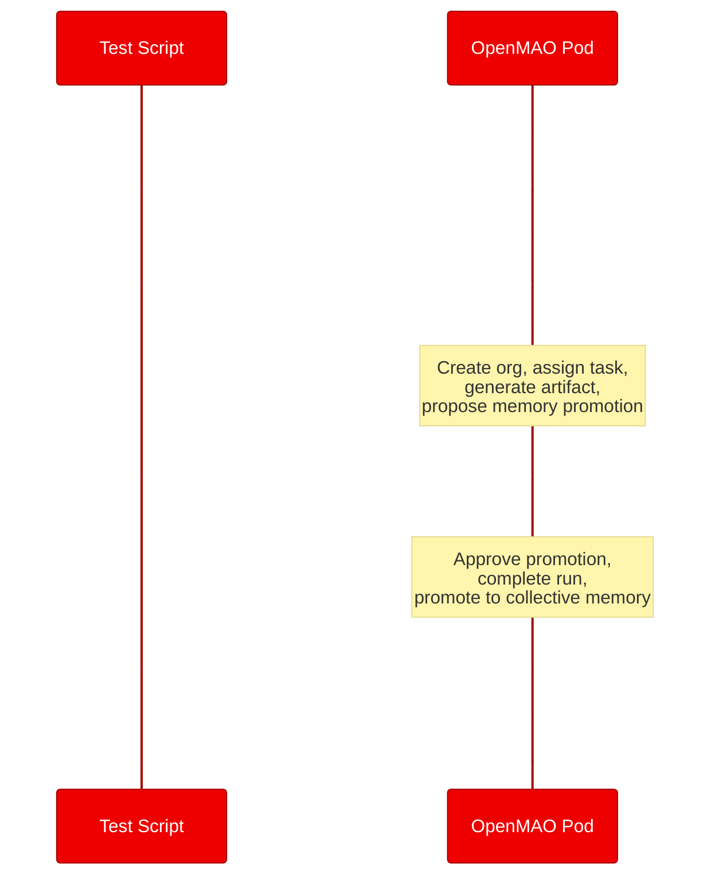

# Deploying AI Governance on OpenShift: A PoC with OpenMAO

*Autonomous agents need guardrails. We containerized OpenMAO, an open-source AI governance substrate, and deployed it on Red Hat OpenShift to prove that accountability infrastructure works alongside AI workloads.*

## What is OpenMAO?

OpenMAO is an open-source governance substrate for AI-native organizations. Instead of handing a swarm of agents the keys and hoping for the best, OpenMAO takes the opposite approach: autonomy is earned, not assumed.

Every action an agent takes is owned, governed, and auditable. The system widens what agents are allowed to do only based on a track record it can prove. The result is a flywheel: governance feeds institutional memory, memory feeds self-correction, and self-correction earns wider autonomy.

The project is self-hostable, Apache-2.0 licensed, and ships with a built-in demo that requires zero API keys, zero LLM calls, and zero external services.

## Why AI governance matters for Red Hat OpenShift AI

Enterprise teams deploying AI agents on Red Hat OpenShift AI face a fundamental tension. Agents need autonomy to be useful, but uncontrolled autonomy creates risk. Before an agent can send emails, deploy code, or modify databases in production, someone needs to answer: who authorized this, what are the boundaries, and where is the audit trail?

OpenMAO addresses this by sitting between your agent frameworks and their side effects:



It provides bounded work envelopes (each task has explicit scope and allowed capabilities), approval gates (consequential actions suspend until approved), institutional memory (shared organizational knowledge promoted after corroboration), and hash-chain event sourcing (every event is cryptographically linked, making tampering detectable).

This governance layer is framework-agnostic. Swap your agent runtime tomorrow and the organization, its memory, and its audit trail remain intact.

## Containerizing for OpenShift

OpenMAO is a Node.js 22 application with only three runtime dependencies: `better-sqlite3` for the event store, `zod` for schema validation, and `zod-to-json-schema` for canonical schemas. No GPU, no Redis, no Postgres.

We used `registry.access.redhat.com/ubi9/nodejs-22` as the base image. The main challenge was that the upstream server binds to `127.0.0.1` and rejects non-loopback connections (a deliberate security measure for local development). We solved this with a lightweight entrypoint wrapper that binds the server to `0.0.0.0` and bypasses the loopback check:

```javascript
// entrypoint.mjs — key logic
const server = createServer({ operatorToken });
const originalListeners = server.listeners("request").slice();
server.removeAllListeners("request");
server.on("request", (req, res) => {
  // Spoof loopback — OpenShift network policies handle access control
  Object.defineProperty(req.socket, "remoteAddress", {
    get: () => "127.0.0.1", configurable: true,
  });
  for (const listener of originalListeners) listener.call(server, req, res);
});
server.listen(port, "0.0.0.0");
```

The `Dockerfile.ubi` installs `gcc` and `make` (needed by `better-sqlite3`'s native addon), runs `npm ci`, and applies OpenShift's arbitrary UID pattern (`chgrp -R 0` then `USER 1001`).

## Deploying to the cluster

We built the image using OpenShift's BuildConfig with binary build strategy (`oc start-build --from-dir`), which uploads the source code to the cluster for building and pushes the result directly to `quay.io/aicatalyst/openmao:latest`.

The Kubernetes manifests are minimal: a Namespace, a Deployment with readiness/liveness probes on `/health`, a ClusterIP Service on port 8080, and a Secret holding the operator console token.



Resource requirements are modest: 256Mi memory and 250m CPU. The pod reached Running state within 43 seconds of applying the manifests.

## Running the PoC validation

We defined five test scenarios that exercise the core governance workflow end-to-end:



| Scenario | What it tests | Result | Duration |
|----------|--------------|--------|----------|
| Health check | API server responds on `/health` | Pass | 0.02s |
| Console accessible | Operator console HTML is served | Pass | 0.01s |
| Run demo | Create org, run agents, suspend at approval gate | Pass | 0.08s |
| Approve demo | Approve promotion, complete run, promote memory | Pass | 0.18s |
| World model | Verify organizational state after workflow | Pass | 0.01s |

All five scenarios passed. The full governance workflow completed in under 300ms total. The demo is deterministic: it creates a two-agent organization, assigns a research task, generates an artifact, proposes promoting it to collective memory, and waits at an approval gate. No LLM calls, no randomness, no external dependencies.

## What we learned

**The loopback restriction was the only real obstacle.** OpenMAO's `isLoopbackAddress` check is a deliberate security decision for local development. In a production deployment on OpenShift, network policies and RBAC handle access control instead, so bypassing the check in the container is appropriate.

**Native compilation works fine on UBI9.** The `better-sqlite3` package compiled cleanly with the GCC toolchain available in the UBI9 nodejs-22 image. No exotic build dependencies were needed.

**OpenShift BuildConfig simplifies CI.** Using `oc start-build --from-dir` for binary builds eliminated the need for a local container runtime. The cluster handles building and pushing to the registry.

**SQLite is sufficient for PoC but needs persistence for production.** The ephemeral SQLite database resets when the pod restarts. For a production deployment, mounting a PersistentVolumeClaim at the `.openmao/` directory would preserve the event store and organizational memory across restarts.

## Try it yourself

The fork with all PoC artifacts is at [github.com/aicatalyst-team/OpenMAO](https://github.com/aicatalyst-team/OpenMAO). The `autopoc-artifacts` branch contains the PoC plan, test script, and full report.

To deploy on your own cluster:

```bash
# Apply the manifests
oc apply -f kubernetes/

# Run the demo workflow
curl -X POST http://openmao.poc-openmao.svc:8080/runs/demo \
  -H "x-openmao-operator-token: <your-token>" \
  -H "x-openmao-actor: operator"

# Approve the governance gate
curl -X POST http://openmao.poc-openmao.svc:8080/runs/demo/approve \
  -H "x-openmao-operator-token: <your-token>" \
  -H "x-openmao-actor: operator"
```

If you're building AI agent systems on Red Hat OpenShift AI, OpenMAO provides the accountability layer between your agents and their side effects. The governance is the feature.
