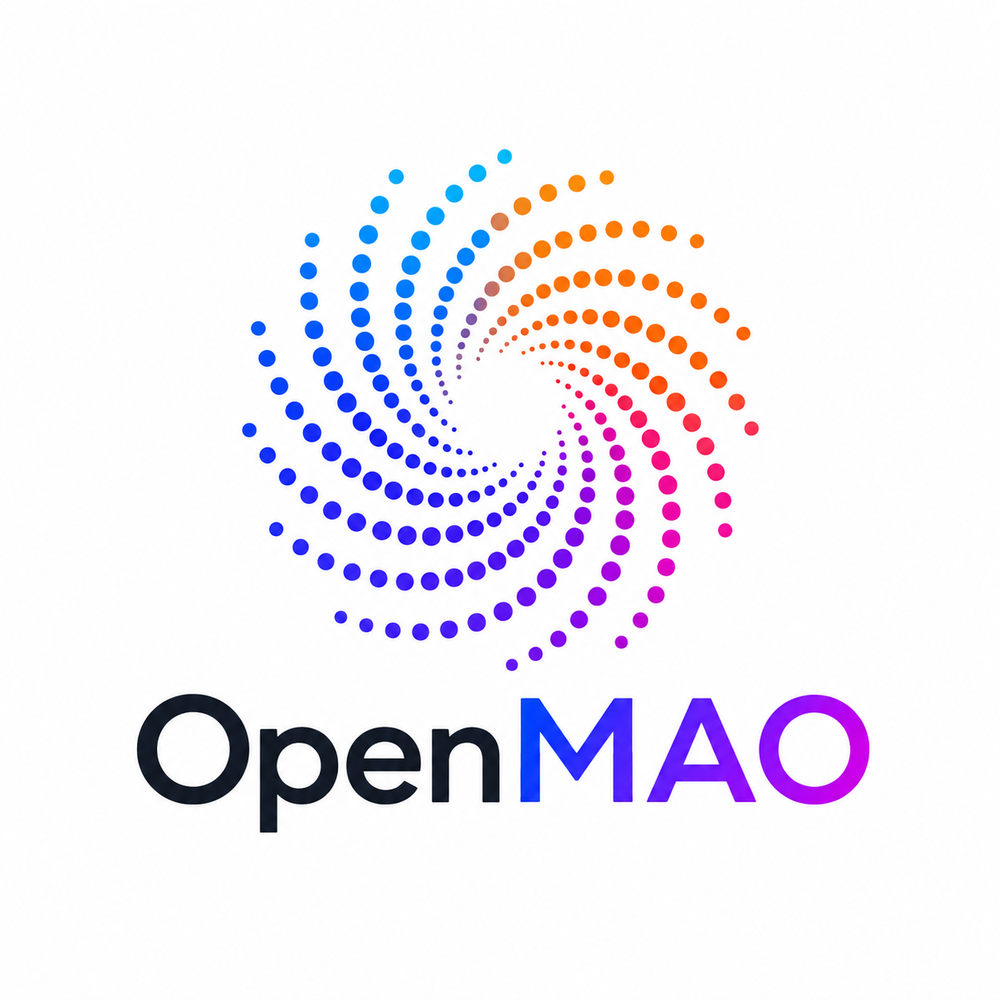

# OpenMAO

<p align="center">
  
</p>

**Build organizations, not just agents.**

OpenMAO is an open-source substrate for AI-native organizations that run themselves, accountably.
You define the mission, roles, goals, and guardrails. Agents do the work. The organization remembers
what it learns, proposes corrections when patterns repeat, and earns more autonomy as it proves it
can be trusted. The human role does not disappear; it rises from operator, to reviewer, to board.

Most autonomous-company demos hand a swarm of agents the keys and hope for the best. OpenMAO takes
the opposite bet:

> **Autonomy is earned, not assumed.**

Every action an agent takes is owned, governed, and auditable, and the system widens what it is
allowed to do only on a track record it can prove. Accountability is not the brake on autonomy; it
is the road to it.

OpenMAO is open source and self-hostable. The organization you build, and everything it learns,
belongs to you, not to a vendor and not to a cloud.

## The Flywheel

OpenMAO is not a pile of features. It is one loop, and the loop is the product:

```text
governance -> institutional memory -> self-correction -> self-learning
    ^                                                        |
    +--------- wider autonomy <- audited track record <------+
```

- **Governance:** makes every action safe and bounded, and for real side effects, non-bypassable.
- **Institutional memory:** turns what one agent learns into trusted, shared organizational knowledge.
- **Self-correction:** turns outcomes into better decisions.
- **Self-learning:** lets the organization improve its own roles, policies, workflows, and capabilities.
- **Audited track record:** earns the next notch of autonomy.

Each turn feeds the next. Anyone can ship one stage; almost no one will build the whole loop. That
loop is the hard, valuable thing, and the reason OpenMAO exists.

## Where It Is Today

OpenMAO is an early, local TypeScript release candidate. It proves the core semantics with a
deterministic demo that needs no API keys, no real LLM calls, and no hosted services: it spins up a
small organization, runs a two-agent workflow, pauses for human approval, resumes from durable
state, promotes memory only after approval, and leaves a fully inspectable event and trace history.

The governance, memory, audit, and first institutional-learning foundations are real and tested.
OpenMAO can detect early operational patterns and create evidence-backed improvement proposals for
human review. The harder frontier is deeper self-correction where an organization diagnoses causes,
versions its structure, and earns wider autonomy over a long audited track record.

License: Apache-2.0.

## Quickstart

Requirements: Node.js 22+, npm, make.

```bash
make install      # install dependencies
make check        # lint, typecheck, tests, public hygiene
make demo         # run the organization until it pauses for approval
make demo-approve # approve and resume from durable state
```

See what the organization currently understands about itself:

```bash
npm run cli -- world --run run_99999999999999999999999999999999
```

Open the operator console. It runs on `127.0.0.1` and prompts for the token the server prints:

```bash
make console
```

## How It Fits

OpenMAO is the system of record for the organization. Your agents, frameworks, and tools are
workers on top of it. Bring whichever you like.

```text
OpenMAO owns: work items, owners, policies, approvals, memory, events, world model
    |
    +-> hands out bounded work envelopes
    +-> agents, frameworks, and tools execute bounded tasks
    +-> risky actions route back through OpenMAO before side effects
    +-> outcomes return as organizational record
```

The boundary is the point: external frameworks may execute bounded tasks, but the work item,
authority, approvals, memory consequences, event history, and world model live in OpenMAO. For
anything that can send, spend, deploy, write, or mutate, OpenMAO sits in the execution path: the
agent cannot reach the side effect without passing the gate. Swap your agent framework tomorrow and
the organization, its memory, and its audit trail remain intact.

Reference adapters for frameworks such as LangGraph, CrewAI, OpenAI Agents SDK, or other runtimes
are examples of this worker boundary, not OpenMAO's product category or source of truth.

## The Autonomy Dial

Autonomy is not a switch. It is a dial that rises with earned trust
(`Organization.autonomy_level`):

- **advisory:** humans do the work; OpenMAO suggests and records.
- **supervised:** agents act; humans approve each consequential action. This is where the local release begins.
- **bounded:** agents act within enforced limits; humans approve high-risk and out-of-bounds actions.
- **board-governed:** future horizon where agents run operations and humans govern at the policy level.

Every widening is earned on audited evidence, and every widening is reversible.

## Contributing

OpenMAO is building toward something hard and worth it: organizations that can be trusted to run
themselves. The governance substrate is the on-ramp; the self-correcting organization is the
destination.

Start with [NORTH_STAR.md](NORTH_STAR.md). It is the first thing to read and it governs the
project's direction. Then read [AGENTS.md](AGENTS.md) and [CONTRIBUTING.md](CONTRIBUTING.md) for
how to work in the repo. The highest-leverage open work is the learning loop; the
[roadmap](docs/ROADMAP.md) lays out the path from here to there.

## Useful Commands

```bash
make lint
make format
make typecheck
make test
make api
make console
npm run cli -- approvals list
npm run cli -- approvals approve <approval_id>
npm run cli -- approvals reject <approval_id>
npm run cli -- events [run_id]
npm run cli -- learning scan
npm run cli -- learning proposals
```

## Documentation

- [NORTH_STAR.md](NORTH_STAR.md) - why OpenMAO exists and where it is going. Start here.
- [docs/ARCHITECTURE.md](docs/ARCHITECTURE.md) - architecture and invariants.
- [docs/ROADMAP.md](docs/ROADMAP.md) - staged path from wedge to flywheel to autonomy dial.
- [docs/POSITIONING.md](docs/POSITIONING.md) - where OpenMAO fits in the wider ecosystem.
- [docs/V0_SCOPE.md](docs/V0_SCOPE.md) - what the first release ships and what is deferred.
- [docs/VOCABULARY.md](docs/VOCABULARY.md) - canonical terms.
- [docs/DEPLOYMENT_MODES.md](docs/DEPLOYMENT_MODES.md) - local, managed, and enterprise shapes.
- [docs/examples/acme_learning_lab.md](docs/examples/acme_learning_lab.md) - default demo walkthrough.
- [CONTRIBUTING.md](CONTRIBUTING.md) - contributor workflow.
- [SECURITY.md](SECURITY.md) - security reporting and expectations.
- [GOVERNANCE.md](GOVERNANCE.md) - project governance.
- [CHANGELOG.md](CHANGELOG.md) - public release history.
- [LICENSE](LICENSE) - Apache-2.0 license.

## Project Boundary

OpenMAO learns from public agent and orchestration projects and may integrate them through governed
worker/capability adapters. It does not clone, vendor, fork, embed, or copy external framework code.

Framework adapters must stay interchangeable: if a team replaces one worker runtime with another,
OpenMAO should still own the work, authority, approvals, memory promotion, audit trail, and world
model.

Do not commit secrets, private data, local-only artifacts, or closed-source project material.
